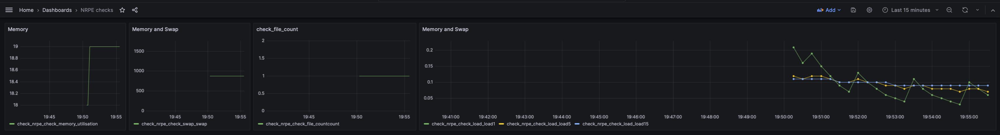

# NRPE to Prometheus

This project is a proof-of-concept supporting a migration from NRPE commands to Prometheus monitoring. The goal is to be able to re-use existing scripts
and expose the metrics in a Prometheus format.

# NRPE-Exporter

This forked version of NRPE-Exporters allows injecting arguments for NRPE clients otherwise the commands just throw an error. To inject arguments for a command
do as follows:

```
  - job_name: nrpe_check_swap
    metrics_path: /export
    params:
      command: [check_swap] # Run the check_load command.
      args: [-w10::-c8] # Arguments to pass to the command. We use special syntax `::` to represent a whitespace on the command otherwise it fails
      prefix: [check_nrpe_check_swap_] # Argument for final metrics exposed
      #ssl: [true] # if using ssl
    static_configs:
      - targets: # Targets to run the specified command against.
        - 'gateway.docker.internal:5666'
    relabel_configs:
      - source_labels: [__address__]
        target_label: __param_target
      - source_labels: [__param_target]
        target_label: instance
      - target_label: __address__
        replacement: nrpe-exporter:9275 # Nrpe exporter.
```

# Collect metrics

1. Login to Grafana `http://localhost:3000` using admin:admin username/password
2. Create a new Prometheus datasource by clicking `Connections` and then `datasource`
3. Enter `http://prometheus:9090` and save the connection
4. Build a dashboard with metrics collected. 
5. Profit



## Important

This project is a POC and by no means should be executed in production. There are many edge cases not being taken into account.